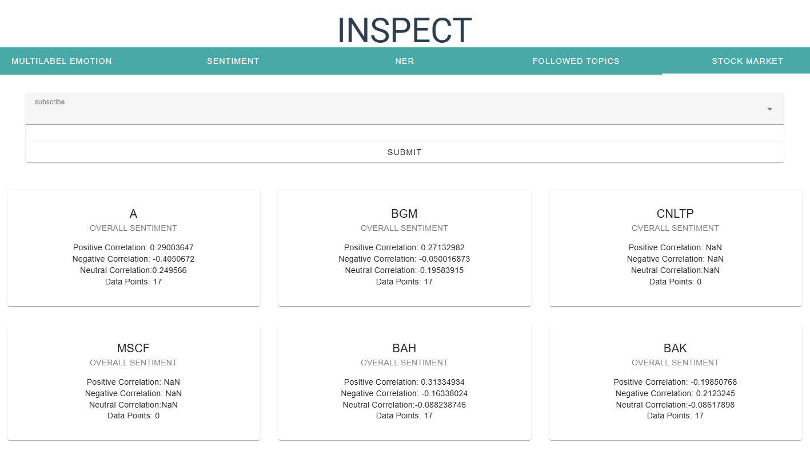
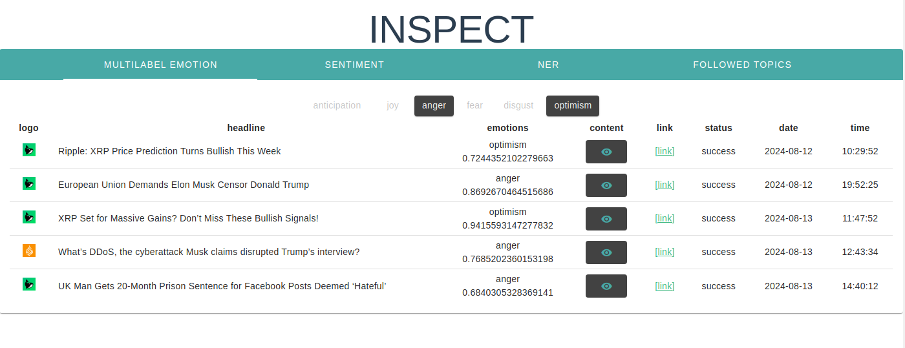
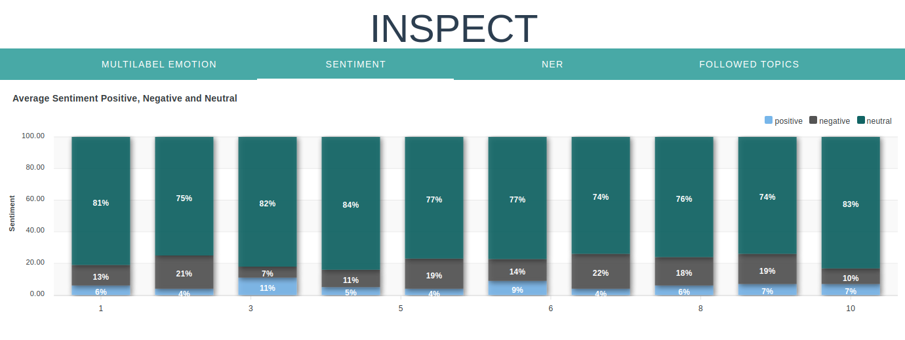
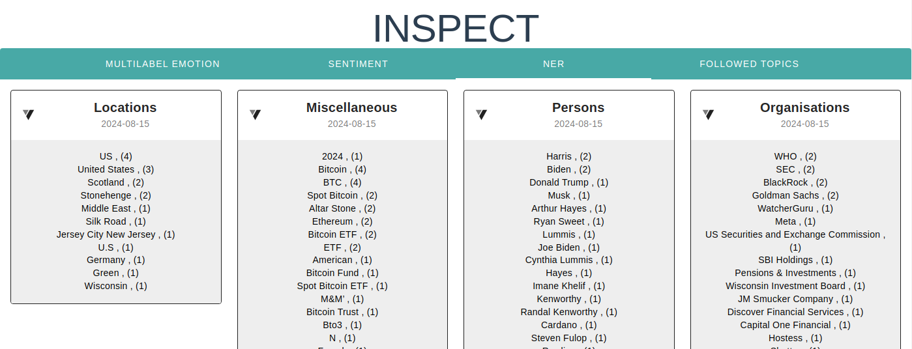
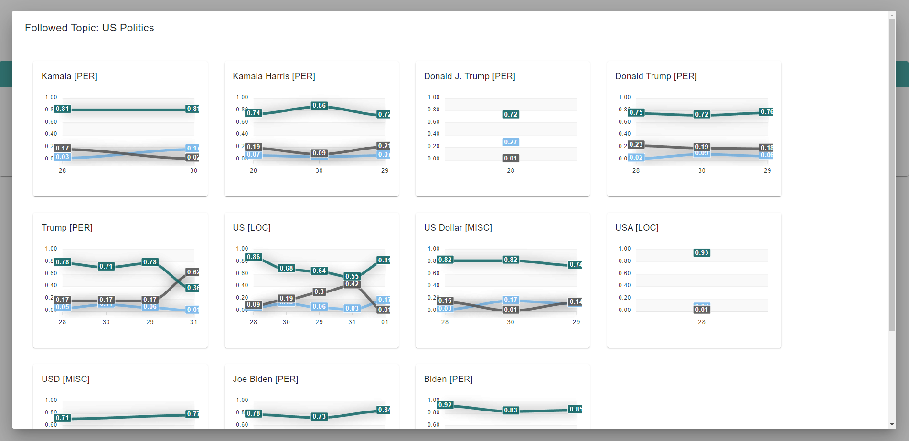
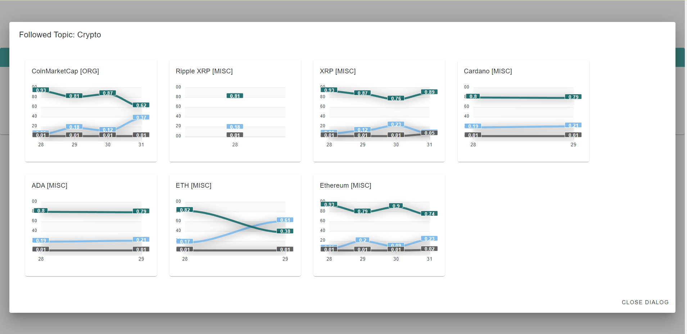

# INSPECT 
INSPECT is a sentiment and NER extraction tool!

New Features 3.0:
- full **Docker** setup
- project now uses (mostly) **reactive** programming 
- stock data collection &rarr; collects **stock data** from polygon
- stock data processing &rarr; computes **correlation between sentiment and stock data** (preview)
- new modules are added as **independent services** in its own Docker containers
- all parameter for application.properties can now be set via **env vars** in the docker containers
- decoupling via **Kafka** Message Broker started (preview)

### Preliminary remarks
1) all webscrapper have been removed for legal reasons 
1) inspect is designed for single user, therefore the inputs are not validated

### Features

#### STOCK SENTIMENT CORRELATION (NEW)
computes correlation between sentiment and stock data

#### EMOTION FILTER
filter article by emotions

#### SENTIMENT BY DAY
track the overall sentiment by day

#### NER
extract important locations, persons, organisations and misc 

#### FOLLOW TOPIC
cluster multiple topics to one umbrella term and track the sentiment over time

### Setup

#### inspect-backend 
CORS_PATTERN &rarr; allowes frontend to request data from backend \
CRED_USER &rarr; login user (if activated) \
CRED_PASS &rarr; login pass (if activated) \
HUGGINGFACE_TOKEN &rarr; token for requesting sentiment analysis, NER, ... \
MONGO_DB_HOST &rarr; mongo db is accessed via this uri \
&nbsp;
- (example config) \
--env=CORS_PATTERN=http://localhost:8080 \
--env=CRED_PASS=123 \
--env=CRED_USER=ft \
--env=HUGGINGFACE_TOKEN=1231123 \
--env=MONGO_DB_HOST=172.17.0.2 \
-p 8081:8081 \
&nbsp;
#### inspect-frontend
no envs \
- (example config) \
-p 8080:8080 \
&nbsp;
#### stock-market-data-collector
POLYGON_API_TOKEN &rarr; collects stock data from polygon.io \
MONGO_DB_HOST &rarr; mongo db is accessed via this uri \
D_SERVER_URI &rarr; this is the uri of the discovery server \

- (example config) \
--env=POLYGON_API_TOKEN=123 \
--env=MONGO_DB_HOST=172.17.0.2 \
--env=D_SERVER_URI=http://172.17.0.2:8761/eureka/ \
-p 8100:8100 \
&nbsp;

#### stock-market-data-processing
MONGO_DB_HOST &rarr; mongo db is accessed via this uri \
D_SERVER_URI &rarr; this is the uri of the discovery server \

- (example config) \
--env=MONGO_DB_HOST=172.17.0.3 \
--env=D_SERVER_URI=http://172.17.0.2:8761/eureka/ \
-p 8200:8200 \
&nbsp;

#### discovery
no envs \
- (example config) \
-p 8761:8761 \

#### MongoDB
you need to pull: [mongodb/mongodb-community-server:6.0.16-ubi9](https://hub.docker.com/layers/mongodb/mongodb-community-server/6.0.19-ubi8/images/sha256-9f85635c9b1d1506ff0a3b4a91ac16136c8e37e33797f8427e33a8341c261487)

### Kafka
you need to pull: [apache/kafka:latest](https://hub.docker.com/r/apache/kafka)
#### APIs: 
Huggingface account (API-key), [Huggingface](https://huggingface.co/)   
polygon account (API-key)  [Polygon](https://polygon.io/)     

